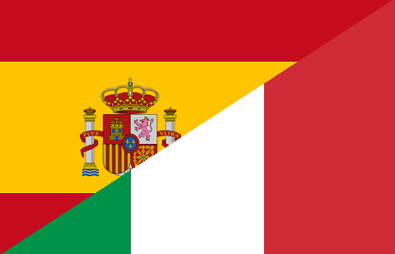

# Latin-Italiano-Hispaniolus
Trying to understand little by little about Latin, the beautiful Italian language and Spanish language of God.

## Table of Contents
1. [Introduction.](#introduction)
2. [Official references websites.](#references)
3. [Latin.](#latin)
4. [Italian.](#italian)
5. [Dante.](#dante)
6. [Spanish.](#spanish)
7. [Influences.](#influence)
8. [GitHub notes.](#github)
9. [GitHub repository calculation.](#calculation)

<a name="introduction"></a>
## 1. Introduction.
 
When you see the word “Romance” in regard to languages, think “Romans,” as in the ancient Roman people who spoke Latin. The 35 modern Romance languages that are considered living languages, including Spanish and Italian, are descended from the Vulgar Latin. “Vulgar” in this case means “common or everyday.” Vulgar Latin was the language of the common people, as opposed to the written Latin language used by scholars and the aristocratic class, which was called Classical Latin.<br /><br />

The Roman Empire broke apart starting around the 5th century C.E. Between the 6th and 9th centuries C.E., the independent countries that developed from the former Roman Empire began to develop the individual Romance languages that became the ancestor-languages of the modern Romance languages. These modern languages include Catalan (spoken in the region of northern Spain around Barcelona), French, Italian, Portuguese, and Romanian.

Although both Italian and Spanish are Romance languages, they are classified as belonging to different sub-families. Both belong to the same Italo-Western branch of Romance languages that also includes French and Portuguese. Then the Itero-Western branch splits off into the Proto-Italian branch, which includes the “main” Italian language and Italy’s regional dialects such as Sicilian and Venetian, and the Western Romance branch proper, which includes Spanish, Spain’s regional dialects, French, France’s regional dialects, and Portuguese.

Of all the Romance languages, Spanish and Italian are considered two of the most “conservative,” a term used in this case to mean that the language’s characteristics remain close to the characteristics of Vulgar Latin. Italy’s Sardinian dialect is considered by linguists to be the closest living language to Vulgar Latin.

<a name="references"></a>
## 2. Official references websites. <br />
Italy government website : http://www.governo.it <br />
Spain government wesbsite : https://www.lamoncloa.gob.es/Paginas/index.aspx <br />

<a name="latin"></a>
## 3. Latin.
Latin is a classical language belonging to the Italic branch of the Indo-European languages. The Latin alphabet is derived from the Etruscan and Greek alphabets and ultimately from the Phoenician alphabet. Latin was originally spoken in the area around Rome, known as Latium. Through the power of the Roman Republic, it became the dominant language in Italy, and subsequently throughout the western Roman Empire. Latin has contributed many words to the English language. In particular, Latin (and Ancient Greek) roots are used in English descriptions of theology, the sciences, medicine, and law.<br />

By the late Roman Republic (75 BC), Old Latin had been standardised into Classical Latin. Vulgar Latin was the colloquial form spoken during the same time and attested in inscriptions and the works of comic playwrights like Plautus and Terence and author Petronius. Late Latin is the written language from the 3rd century and the colloquial form Vulgar Latin developed into the Romance languages, such as French, Italian, Portuguese, Romanian, Catalan and Spanish in the 6th to 9th centuries. Medieval Latin was used as a literary language from the 9th century to the Renaissance which used Renaissance Latin. Later, Early Modern Latin and New Latin evolved. Latin was used as the language of international communication, scholarship and science until well into the 18th century, when it began to be supplanted by vernaculars (including the Romance languages). Ecclesiastical Latin remains the official language of the Holy See and the Roman Rite of the Catholic Church.

Latin is a highly inflected language, with three distinct genders, up to seven noun cases, five declensions, four verb conjugations, six tenses, three persons, three moods, two voices, two or three aspects and two numbers.

<a name="italian"></a>
## 4. Italian.
Italian is a major European language, being one of the official languages of the Organization for Security and Co-operation in Europe and one of the working languages of the Council of Europe. It is the fourth most widely spoken first language in the European Union with 69 million native speakers (13% of the EU population) and it is spoken as a second language by 16 million EU citizens (3%). Including Italian speakers in non-EU European countries (such as Switzerland and Albania) and on other continents, the total number of speakers is around 90 million. Italian is the main working language of the Holy See, serving as the lingua franca (common language) in the Roman Catholic hierarchy as well as the official language of the Sovereign Military Order of Malta. Italian is known as the language of music because of its use in musical terminology and opera. Its influence is also widespread in the arts and in the luxury goods market.

Italian was adopted by the state after the Unification of Italy, having previously been a literary language based on Tuscan as spoken mostly by the upper class of Florentine society. Its development was also influenced by other Italian languages and to some minor extent, by the Germanic languages of the post-Roman invaders. The incorporation into Italian of learned words from its own ancestor language, Latin, is another form of lexical borrowing through the influence of written language, scientific terminology and the liturgical language of the Church. Throughout the Middle Ages and into the early modern period, most literate Italians were also literate in Latin; and thus they easily adopted Latin words into their writing—and eventually speech—in Italian. Its vowels are the second-closest to Latin after Sardinian. As in most Romance languages, stress is distinctive and, unlike most other Romance languages, Italian retains Latin's contrast between short and long consonants. Almost all native Italian words and syllables finish with pure vowels, a factor that makes Italian words extremely easy to use in rhyming. Italian has a 7 vowel sound system ('e' and 'o' have mid-low and mid-high sounds); Classical Latin had 10, 5 with short and 5 with long sounds.

<a name="dante"></a>
## 5. Dante.
Durante di Alighiero degli Alighieri, commonly known by his pen name Dante Alighieri or simply as Dante, was an Italian poet. His Divine Comedy, originally called Comedìa (modern Italian: Commedia) and later christened Divina by Giovanni Boccaccio, is widely considered the most important poem of the Middle Ages and the greatest literary work in the Italian language.

In the Late Middle Ages, most poetry was written in Latin, making it accessible only to the most educated readers. In De vulgari eloquentia (On Eloquence in the Vernacular), however, Dante defended the use of the vernacular in literature. He would even write in the Tuscan dialect for works such as The New Life (1295) and the Divine Comedy; this highly unorthodox choice set a precedent that important later Italian writers such as Petrarch and Boccaccio would follow.

Dante was instrumental in establishing the literature of Italy, and his depictions of Hell, Purgatory and Heaven provided inspiration for the larger body of Western art. He is cited as an influence on John Milton, Geoffrey Chaucer and Alfred Tennyson, among many others. In addition, the first use of the interlocking three-line rhyme scheme, or the terza rima, is attributed to him. He is described as the "father" of the Italian language, and in Italy, he is often referred to as il Sommo Poeta ("the Supreme Poet"). Dante, Petrarch, and Boccaccio are also called the tre corone ("three crowns") of Italian literature.

<a name="spanish"></a>
## 6. Spanish.
It is estimated that there are more than 437 million people who speak Spanish as a native language, which qualifies it as second on the lists of languages by number of native speakers. Instituto Cervantes claims that there are an estimated 477 million Spanish speakers with native competence and 572 million Spanish speakers as a first or second language—including speakers with limited competence—and more than 21 million students of Spanish as a foreign language.

Spanish is the official or national language in Spain, Equatorial Guinea, and 19 countries in the Americas. Speakers in the Americas total some 418 million. It is also an optional language in the Philippines as it was a Spanish colony from 1569 to 1899. In the European Union, Spanish is the mother tongue of 8% of the population, with an additional 7% speaking it as a second language. The country with the largest number of native speakers is Mexico. Spanish is the most popular second language learned in the United States. In 2011 it was estimated by the American Community Survey that of the 55 million Hispanic United States residents who are five years of age and over, 38 million speak Spanish at home.

In Spain and in some other parts of the Spanish-speaking world, Spanish is called not only español (Spanish) but also castellano (Castilian), the language from the kingdom of Castile, contrasting it with other languages spoken in Spain such as Galician, Basque, Asturian, Catalan, Aragonese and Occitan.

<a name="influence"></a>
## 7. Influences.
Spanish hegemony in Italy extended beyond the states under its direct control. The rulers of Savoy and Tuscany owed their titles to Spain, Genoa acted as Spain’s chief banker, the papacy depended heavily on the Spanish monarchy in the age of the Counter-Reformation, and even independent Venice needed Spanish aid in protecting its Mediterranean empire from further erosion by the Turks. Several minor states were so small that they had little political influence; these included the republic of Lucca as well as several duchies that remained under the control of local noble families—the duchies of Modena, Reggio, and Ferrara under the Este family; the duchy of Mantua and Montferrat under the Gonzagas, and the duchy of Parma and Piacenza under the Farnese. These states, too, enjoyed the enforced Spanish peace within Italy and benefited from the security against foreign invasion. Their nobility intermarried with the Spanish aristocracy and absorbed Spanish culture.

In politics, the papacy was dependent on Spain yet eager to find an alternative to Spanish domination in Italy. Although ecclesiastical reform occupied most of the church’s energies, Pope Pius V (reigned 1566–72) promoted the Holy League, which checked Ottoman expansion into the western Mediterranean by defeating the Ottoman fleet at Lepanto (1571). Under Pope Gregory XIII (reigned 1572–85) the Julian calendar was reformed into the modern Gregorian calendar. Pope Sixtus V (reigned 1585–90) launched a Catholic missionary counteroffensive in central Europe and reorganized the Roman Curia. He, along with Clement VIII (reigned 1592–1605), also patronized the urban development and new artistic flowering in Rome that culminated in the Baroque creations of Gian Lorenzo Bernini and the architect Francesco Borromini. These two popes also fought rural banditry and brought Ferrara, Urbino, and Castro back under direct papal rule.

<a name="github"></a>
## 8. GitHub notes.
Clone the current GitHub remote repository contents into local machine.
```
$ git clone https://github.com/syakirharis25/Latin-Italiano-Hispaniolus.git
$ cd Latin-Italiano-Hispaniolus/
$ git remote -v
$ git status
```

<a name="calculation"></a>
## 9. GitHub repository calculation.
```
-------------------------------------------------------------------------------
Language                     files          blank        comment           code
-------------------------------------------------------------------------------
Markdown                         1             17              0             45
-------------------------------------------------------------------------------
```
Refer to : https://github.com/syakirharis25/cloc
